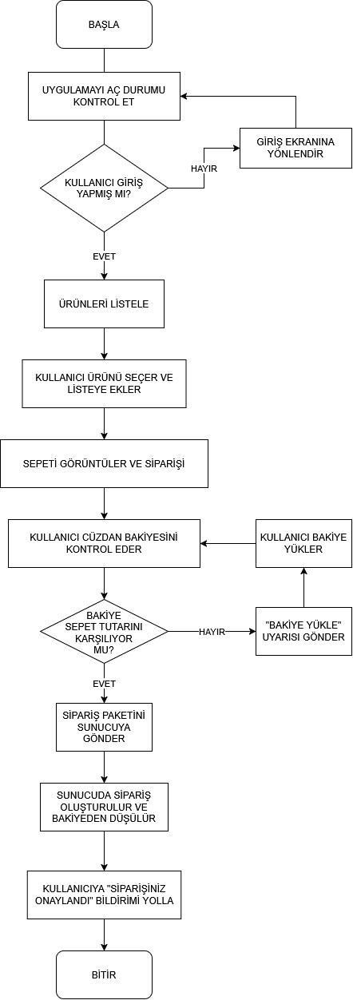

GÖREV 1: AKIŞ ŞEMASI || SÖZDE KOD
SEÇENEK A AKIŞ ŞEMASI:

SEÇENEK B SÖZDE KOD:

Algoritma:KahveGoSiparisUygulamasi

Girdi:KullanıcıOturumDurumu,SepetTutarı,CuzdanBakiyesi

Çıktı:SiparisDurumu

Adım1:Başla

Adım2:Kullanıcını giriş durumunu kontrol et

Adım3:EĞER kullanıcı giriş yapmış ise Adım5'e git DEĞİLSE Adım4'e git

Adım4:Kullanıcıyı giriş ekranına yönlendir giriş işlemini yaptıktan sonra Adım5' geç

Adım5:Ürünleri listele

Adım6:Kullanıcıdan ürün seçmesini ve sepete ekelmesini iste

Adım7:EĞER kullanıcı daha ürün eklemek istiyorsa Adım6'ya git istemiyorsa  Adım8'e git

Adım8:Sepeti görüntüle ve sepet tutarını hesapla

Adım9:Kullanıcıdan sepet onayı al

Adım10:Sepet tutarı ile kullanıcı bakiyesini karşılaştır

Adım11:EĞER CuzdanBakiyesi>=SepetTutarı İSE Adım14'e git

Adım12:Ekrana "Bakiye Yükle" mesajı ver 

Adım13:EĞER kullancı yeterli bakiye yüklerse Adım14'e git yetersiz bakiye yükler VEYA bakiye yüklemezse Adım18'e git

Adım14:Sipariş paketini sunucuya gönder

Adım15:Sunucuda siparişi oluştur

Adım16:CuzdanBakiyesi=CuzdanBakiyesi-SepetTutarı

Adım17:Ekrana "Siparişiniz Başarıyla Oluşturuldu" yazdır

Adım18:Bitir

||||||||||||||||||||||||||||||||||||||||||||
GÖREV 2: REST API Uç Noktası & JSON Tasarımı
1. Sipariş Oluşturma Endpoint'i

HTTP Metodu: POST
URL: /api/v1/siparisler

Header'lar:
Authorization: Bearer
Content-Type: application/json

Response(JSON){
"kahve_adi": "Latte",
  "boyut": "Orta",
  "adet": 2,
  "toplam_tutar": 145.00,
}

Başarılı Sonuç HTTP Durum Kodu: 201 Created

{
  "siparis_id": "ıd",
  "durum": "alindi",
  "tahmini_hazirlanma_suresi_dk": 
}

Kullanıcı Giriş Yapmamışsa Dönecek Kod: 401 Unauthorized

{
  "hata_kodu": "TOKEN_GECERSIZ",
  "mesaj": "Oturum bulunamadı veya token süresi dolmuş."
}

2. Cüzdan Bakiye Sorgulama Endpoint'i

HTTP Metodu: GET
URL: /api/v1/kullanici/bakiye

Authorization: Bearer <token>

Başarılı Sonuç HTTP Durum Kodu: 200 OK

{
  "bakiye": 185.50,
  "para_birimi": "TRY"
}

Sunucuda Beklenmeyen Hata Çıkarsa Dönecek Kod: 500 Internal Server Error

{
  "hata_kodu": "SUNUCU_HATASI",
  "mesaj": "Beklenmeyen bir hata oluştu, lütfen tekrar deneyin."
}

Mini Mülakat Sorusu

GET isteği idempotenttir, çünkü aynı isteği bir kez veya art arda yüz kez de gönderseniz sunucuda hiçbir veri değişmez; sadece mevcut bakiye tekrar tekrar okunup döndürülür. POST isteği ise idempotent değildir, çünkü her tekrar gönderildiğinde sunucudaki veri her seferinde değişir/artar.

||||||||||||||||||||||||||||||||||||||||||||
GÖREV 3: Clean Code & SOLID Prensip Teşhisi

1. Single Responsibility Principle (SRP) İhlali

KahveSiparisYoneticisi sınıfı tek başına hesaplama (sepet/indirim), ödeme (kredi kartı tahsilatı), veri erişimi (veritabanına kaydetme) ve bildirim (SMS gönderme) gibi birbirinden tamamen farklı dört ayrı sorumluluğu üstlenmiş durumda; oysa bir sınıfın değişmek için yalnızca tek bir nedeni olmalıdır. Bu yüzden sınıf; IndirimHesaplayici, OdemeIslemcisi (PaymentProcessor), SiparisRepository (veritabanı işlemleri) ve BildirimServisi (SMS/e-posta) gibi bağımsız, tek işi olan sınıflara bölünmelidir.

2. Open/Closed Principle (OCP) İhlali

indirimHesapla fonksiyonu, yeni bir müşteri tipi (örneğin "DOKTOR") geldiğinde mevcut if-else bloğunun doğrudan değiştirilmesini gerektiriyor; bu da Open/Closed Principle'a aykırıdır çünkü bu prensibe göre bir sınıf/fonksiyon genişletmeye açık, değişikliğe kapalı olmalıdır — yani yeni bir davranış eklemek için var olan, test edilmiş kodu bozma riskiyle karşı karşıya kalmak yerine, yeni bir alt sınıf veya strateji (örneğin her müşteri tipi için ayrı bir IndirimStratejisi implementasyonu) eklenerek sistemin genişletilebilmesi gerekir.
