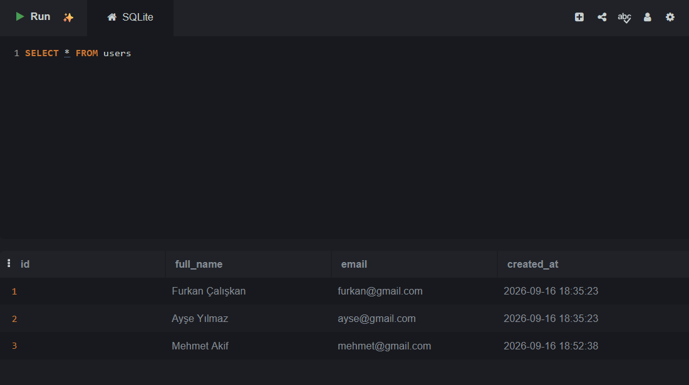
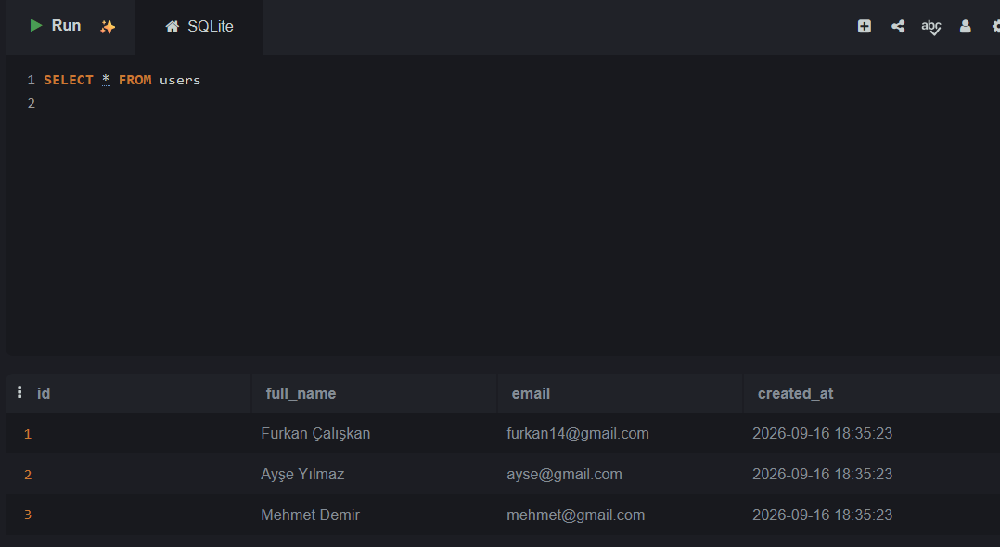
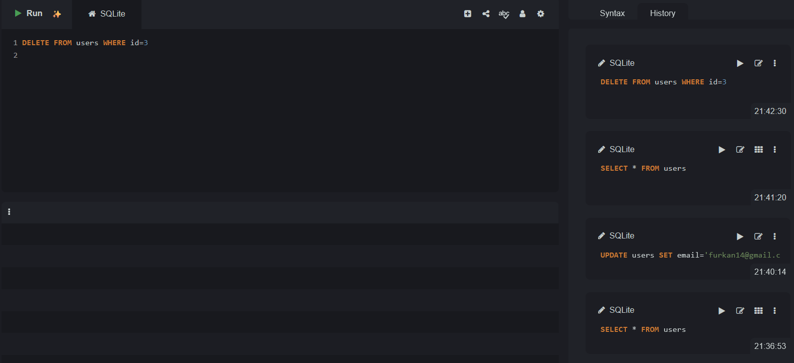
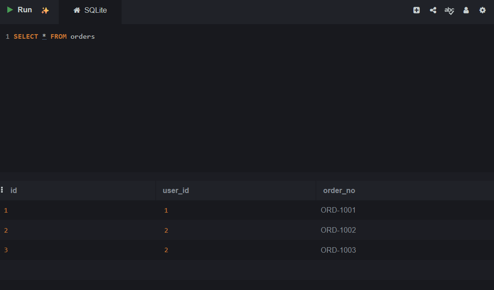
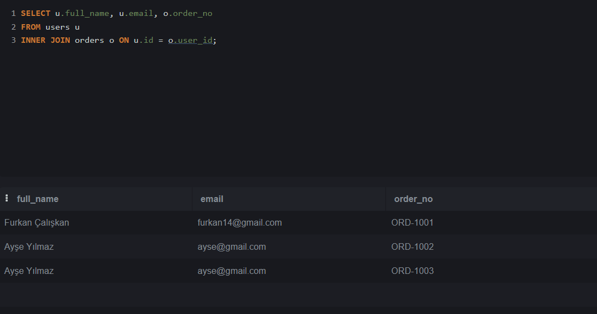

# Ödev: SQL CRUD, INNER JOIN ve Mobil Uygulama Güvenliği

## 1. SQL CRUD İşlemleri

### Tablo Oluşturma ve Kullanıcı Ekleme (CREATE / INSERT)

```sql
PRAGMA foreign_keys=ON;

CREATE TABLE IF NOT EXISTS users(
  id INTEGER PRIMARY KEY AUTOINCREMENT,
  full_name TEXT NOT NULL,
  email TEXT UNIQUE NOT NULL,
  created_at DATATIME DEFAULT CURRENT_TIMESTAMP
);

INSERT INTO users(full_name, email) VALUES
('Furkan Çalışkan','furkan@gmail.com'),
('Ayşe Yılmaz','ayse@gmail.com'),
('Mehmet Demir','mehmet@gmail.com');
```
### Kullanıcıları Listeleme (SELECT)

```sql
SELECT * FROM users;
```


### Email Güncelleme (UPDATE)

```sql
UPDATE users SET email='furkan14@gmail.com' WHERE id=1;
```


### Kullanıcı Silme (DELETE)

```sql
DELETE FROM users WHERE id=1;
```


## 2. INNER JOIN

`orders` tablosunun oluşturulması ve örnek veriler:

```sql
CREATE TABLE IF NOT EXISTS orders(
  id INTEGER PRIMARY KEY AUTOINCREMENT,
  user_id INTEGER NOT NULL,
  order_no TEXT NOT NULL,
  FOREIGN KEY (user_id) REFERENCES users(id)
);

INSERT INTO orders(user_id, order_no) VALUES
(1, 'ORD-1001'),
(2, 'ORD-1002'),
(2, 'ORD-1003');
```


INNER JOIN sorgusu:

```sql
SELECT u.full_name, u.email, o.order_no
FROM users u
INNER JOIN orders o ON u.id = o.user_id;
```


## 3. Mobil Uygulama Güvenliği

### a) Ekran görüntüsü ve ekran kaydı

Bankacılık uygulamalarında kredi kartı bilgisi veya bakiye gibi hassas veriler ekranda gösterilirken ekran görüntüsü/kaydı alınabilmesi, bu bilgilerin kullanıcı bilmeden veya izinsiz bir şekilde başka kişilerle paylaşılmasına, kötü amaçlı yazılımlar tarafından toplanmasına ya da telefon kaybolduğunda/başkasının eline geçtiğinde galeri üzerinden görüntülenmesine yol açabilir. Bu yüzden hassas ekranlarda bu işlevin engellenmesi önemlidir.

- **Android:** `FLAG_SECURE` bayrağı ilgili `Window` nesnesine eklenerek o ekranın görüntüsünün alınması ve ekran kaydına dahil edilmesi engellenir.
- **iOS:** Doğrudan Android'deki gibi tam bir engelleme mekanizması yoktur, ancak `UIScreen.capturedDidChangeNotification` ile ekran kaydının başladığı tespit edilip hassas içerik gizlenebilir; `isCaptured` özelliğiyle de anlık kayıt durumu kontrol edilebilir.

### b) Overlay saldırıları

Bir saldırgan, kullanıcının cihazına yüklettiği zararlı bir uygulama aracılığıyla, ekranın üzerine görünmez veya gerçek uygulamayla neredeyse aynı görünen sahte bir katman (overlay) yerleştirebilir. Kullanıcı gerçek uygulamayı kullandığını sanırken aslında bu sahte katmana dokunmuş olur.

**Örnek:** Kullanıcı bankacılık uygulamasında "Onayla" butonuna bastığını düşünürken, aslında üzerine yerleştirilmiş görünmez bir buton sayesinde saldırganın uygulamasına kart bilgilerini girmiş veya yetkisiz bir işlemi onaylamış olabilir (tapjacking).

### c) Root / Jailbreak

Root edilmiş veya jailbreak yapılmış bir cihazda, işletim sisteminin normalde uygulamalara ve kullanıcıya kapalı tuttuğu dosya sistemi ve bellek alanlarına erişim serbestleşir. Bu da güvenlik sınırlarının (sandbox) etkisiz hale gelmesine neden olur.

**Örnek:** Root edilmiş bir cihazda saldırgan, uygulamanın çalışma anında bellekte tuttuğu şifrelenmemiş access token'ı bir bellek dump aracıyla okuyabilir, ya da uygulamanın normalde erişilemeyen özel dizinindeki (`/data/data/paket_adi/`) yerel veritabanı dosyasını doğrudan kopyalayıp inceleyebilir.

### d) SQLite ve şifreleme

Normal bir SQLite veritabanı dosyası varsayılan olarak şifrelenmemiştir; kullanıcı adı, email, hatta bazen token gibi bilgiler düz metin (plaintext) olarak diskte durur. Cihaza fiziksel erişimi olan biri (özellikle root edilmiş bir cihazda) bu `.db` dosyasını doğrudan kopyalayıp herhangi bir SQLite görüntüleyiciyle açarak tüm verileri okuyabilir.

**SQLCipher** kullanıldığında veritabanı dosyasının tamamı bir şifreleme anahtarıyla (genelde AES) şifrelenir; dosya diskten çalınsa veya kopyalansa bile doğru anahtar olmadan içeriği okunamaz, veriler anlamsız bir bayt dizisi olarak görünür.

### e) Access Token ve Refresh Token

Access token, kullanıcının API isteklerinde kimliğini kanıtlamak için kullandığı, kısa ömürlü bir anahtardır. Refresh token ise access token süresi dolduğunda, kullanıcıyı tekrar şifre girmeye zorlamadan yeni bir access token almasını sağlayan, daha uzun ömürlü bir anahtardır.
- **Access token neden kısa süreli tutulur:** Eğer bu token çalınırsa, saldırganın onu kullanabileceği süre pratikte çok kısa kalır; kısa ömür, olası bir sızıntının etkisini sınırlar.
- **Refresh token neden daha güvenli saklanmalı:** Refresh token çalınırsa saldırgan sürekli yeni access token üretebilir, yani kalıcı bir erişim elde eder; bu yüzden genellikle şifrelenmiş depolama (Android'de Keystore, iOS'ta Keychain) gibi normal uygulama verisinden daha korumalı alanlarda tutulur.
- **Çıkışta neden iptal edilebilir:** Kullanıcı çıkış yaptığında refresh token sunucu tarafında geçersiz kılınabilir (blacklist'e alınabilir), böylece token cihazda bir şekilde kalsa veya ele geçirilse bile artık yeni access token üretmek için kullanılamaz.